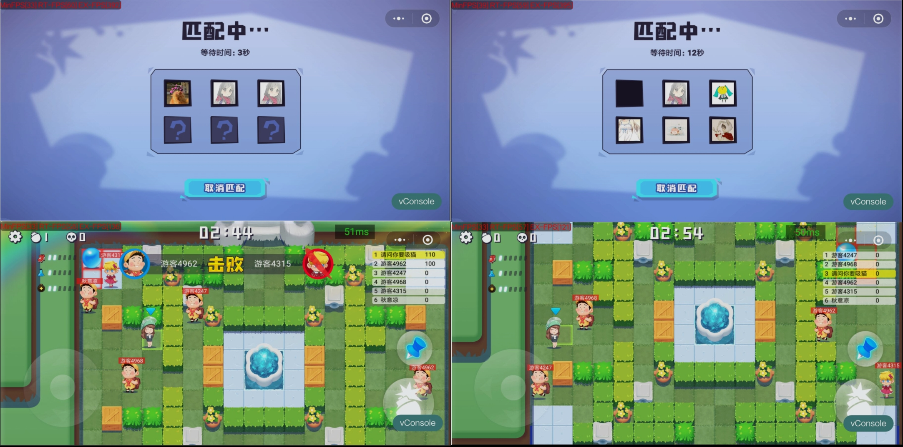
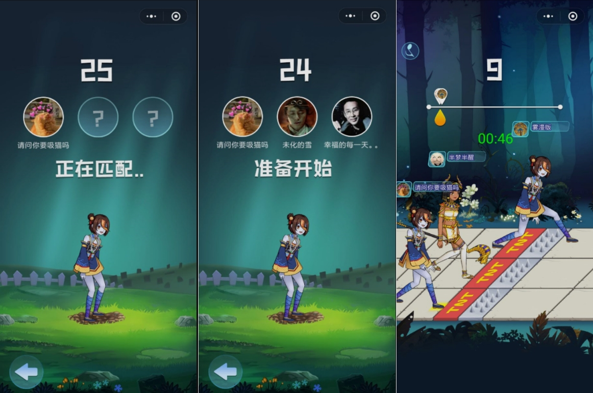

# Bfmq
从实际项目中剥离和重实现的玩具帧同步服务，早期项目，仅供学习使用  
a tiny websocket lockstep game server for moba rts fps ....
very fast!!!

# Deps
1.  go get -u github.com/golang/protobuf/protoc-gen-go
2.  go get -u github.com/gobwas/ws

# Usage
1.  go install bfmq
2.  go run testbfmq.go

# Example 
1.  testbfmq.go

# Thanks
fighting https://github.com/viphxin/fighting

# Projects

